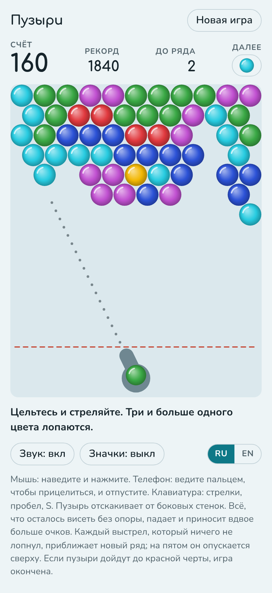
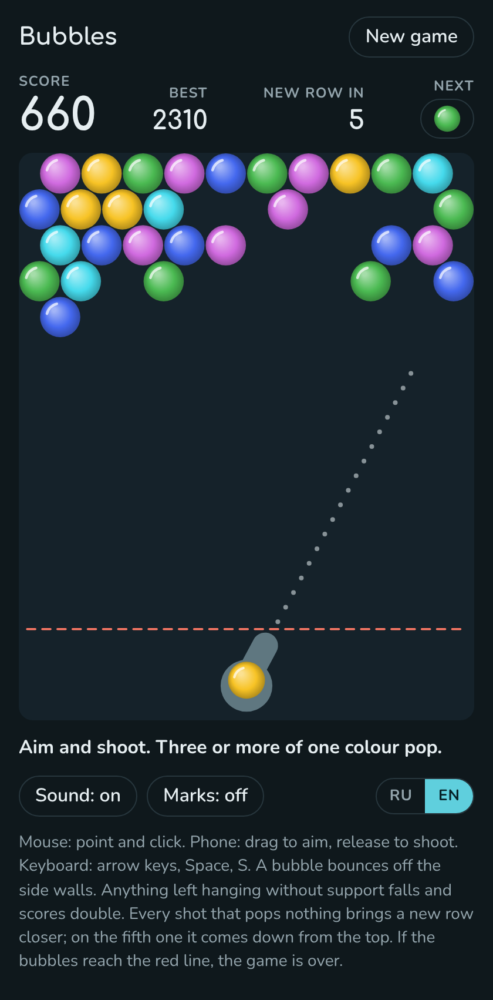

# Bubbles

[Русская версия](README.ru.md)

A browser bubble shooter. Bubbles hang from the top of the field and a cannon at the bottom shoots more of them. Bring three or more of one colour together and they pop. Clear the field before the rows come down to the cannon.

  
  

Left: the light theme with the Russian interface. Right: the dark theme with the English one.

## Rules

- The shot bubble sticks where it lands. If it is now part of a group of three or more touching bubbles of one colour, the whole group pops.
- Bubbles that no longer hang from the top, directly or through other bubbles, fall.
- A shot that pops nothing brings a new row closer. On the fifth such shot a new row comes down from the top and the count starts again.
- The game is lost when a bubble goes below the red line.
- The game is won when the field is empty.
- The cannon is only loaded with colours that are still on the field.

## Scoring

| Bubble | Points |
| --- | --- |
| Popped | 10 |
| Fallen | 20 |

The best score is kept as soon as it is beaten.

## Controls

- Mouse: point to aim, click to shoot.
- Phone: drag to aim, release to shoot. Release below the cannon to cancel the shot.
- Keyboard: left and right arrows aim, with Shift for fine steps. Space or Enter shoots. S swaps the bubbles.
- The Next button swaps the bubble in the cannon with the next one.

A bubble bounces off the side walls. The dotted line shows the start of its flight.

The Marks switch draws a different sign on each colour, for players who find some of the colours hard to tell apart.

An unfinished game, the best score and the settings are kept in the player's browser.

## Language

The interface is in English and Russian. It opens in Russian when Russian is among the browser's languages and in English otherwise. The RU/EN switch remembers your choice.

## How to run

The whole game is one file, `index.html`. There is no build step and there are no dependencies. Open `index.html` in a browser.

Fonts load from Google Fonts. Without a network the game falls back to system fonts.

## Visit counter

The page carries a [GoatCounter](https://www.goatcounter.com/) visit counter. According to the service, it sets no cookies and stores no personal data. The counter does not run when `index.html` is opened from disk.

## Credits

The game was written by Claude, the AI assistant made by Anthropic: the logic, the canvas graphics, the sound and the page design.

The rules follow the classic bubble shooter games. The design of this version is its own.

The idea of making a browser version and the name came from posoxAI.

## License

MIT. The full text is in [LICENSE](LICENSE).
